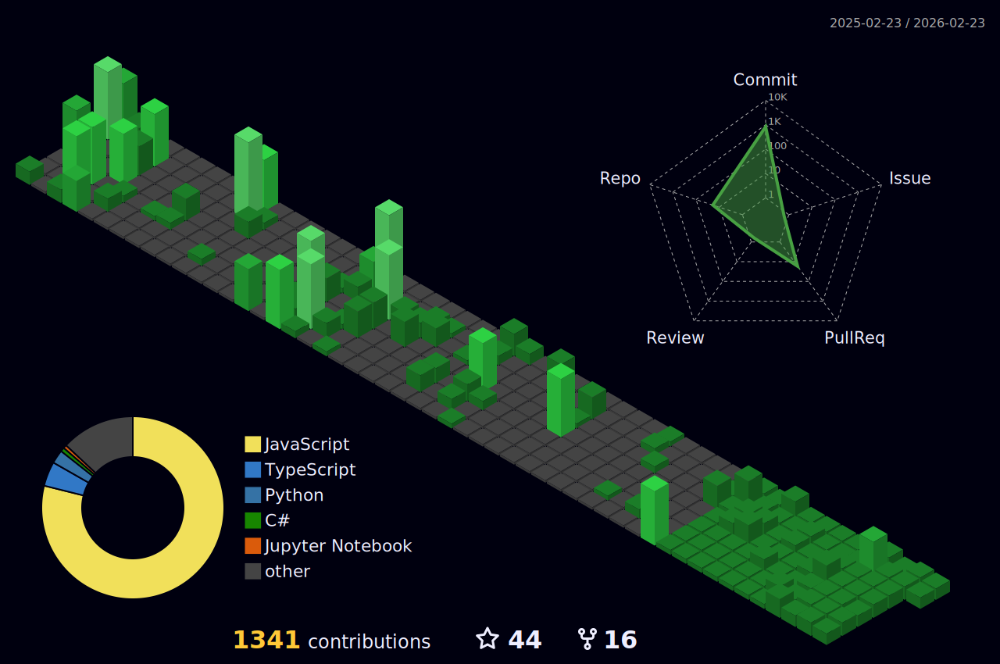

<table>
  <tr>
    <td width="30%" valign="center">
      
    </td>
    <td width="70%" valign="center">
      <h1>HELLO / ආයුබෝවන් / こんにちは 👋🏻</h1>
      <h3><b>Cloud Infrastructure & DevOps Aspirant 🇱🇰</b></h3>
      

         <em>"Automating the boring stuff so I can focus on the cool stuff."</em> 🚀
      

      

        🔭 <b>Current Focus:</b> Docker, Kubernetes & CI/CD Pipelines 
        🎓 <b>Undergraduate:</b> Information Technology
      

      

        ⚙️ <b>I use daily:</b> <code>.py</code> <code>.yml</code> <code>.dockerfile</code> <code>.sh</code> <code>.json</code> 
        🔨 Uhhh, I try to automate my entire life btw.
      

      
    </td>
  </tr>
</table>

---

  

---

## 🚀 Engineering Highlights

| 🌦️ [Weather Sentinel](https://github.com/nipuna-lakruwan/weather-sentinel) | 📰 [News Dashboard](https://github.com/nipuna-lakruwan/news-dashboard) |
|:---:|:---:|
| Real-time weather monitoring system | Interactive news aggregation platform |
|   |   |

<table>
  <tr>
    <td width="45%" valign="top">
       
      <h3>🛠️ The DevOps Arsenal</h3>
      

        <strong>Infrastructure & Cloud</strong> 
         
         
        
      

      

        <strong>Scripting & Backend</strong> 
         
         
        
      

      

        <strong>Databases & Tools</strong> 
         
         
        
      

    </td>
    <td width="55%" valign="top">
      <h2>⚡ Latest Work & Metrics</h2>
      
<em>(Auto-Updated)</em>

      
    </td>
  </tr>
</table>

---

## 📊 Analytics & Activity

  
  

  

  
  

  

  
  

