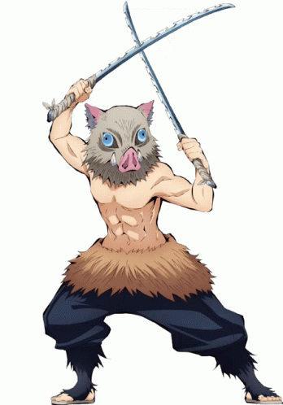
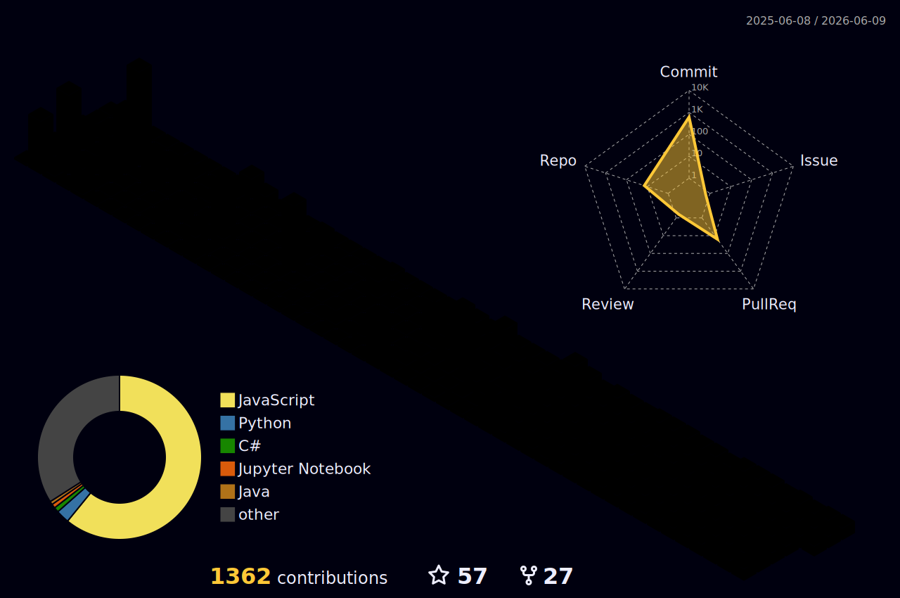

<div align="center">


<br/>

<a href="https://github.com/nipuna-lakruwan">
  
</a>
&nbsp;

&nbsp;

&nbsp;

&nbsp;


</div>

<br/>

---

<div align="center">
  
</div>

---

## 🧠 Who I Am

<table>
<tr>
<td width="33%" align="center" valign="top">
<br/>

<br/><br/>

**HELLO / ආයුබෝවන් / こんにちは** 👋🏻

<br/>

[](https://www.linkedin.com/in/nipuna-lakruwan-6b740627a)
[](mailto:senarath.lakruwan@gmail.com)
[](https://github.com/nipuna-lakruwan)
[](https://skyline.github.com/nipuna-lakruwan/2025)

</td>
<td width="67%" valign="top">

I started by automating systems — Docker, CI/CD, Linux. Now I'm building the systems **that think.** With a foundation in cloud infrastructure and a growing obsession with AI, I sit at the intersection of reliable engineering and intelligent products.

> *I don't just run models. I ship products.*

```python
class NipunaLakruwan:
    def __init__(self):
        self.name       = "Nipuna Lakruwan"
        self.pronouns   = "he / him"
        self.location   = "Sri Lanka 🇱🇰"
        self.education  = "B.Sc. Information Technology"
        self.languages  = ["Sinhala 🇱🇰", "English", "日本語 (learning)"]
        self.open_to    = ["Remote Work", "AI Projects", "Open Source"]

    @property
    def stack(self) -> dict:
        return {
            "ai_ml"   : ["Python", "LangChain", "OpenAI API", "HuggingFace"],
            "backend" : ["FastAPI", "Node.js", "REST APIs", "PHP"],
            "infra"   : ["Docker", "Kubernetes", "GitHub Actions", "Linux"],
            "data"    : ["Redis", "PostgreSQL", "MySQL"],
        }

    def currently(self) -> str:
        return "Shipping AI products that actually work 🚀"

    def motto(self) -> str:
        return "Build. Ship. Learn. Repeat. ✨"
```

</td>
</tr>
</table>

---


## ⚡ The Arsenal

<div align="center">

### 🤖 AI & Machine Learning


### ☁️ Cloud & DevOps


### 🖥️ Languages & Backend


### 🗄️ Databases & Tools


</div>

---

## 🎯 What I'm Building Right Now

<div align="center">

| Skill | Progress | Context |
|:---|:---:|:---|
| 🤖 LangChain & RAG Systems | `████████░░` **80%** | Building retrieval-augmented pipelines |
| ⚡ FastAPI for AI Services | `█████████░` **90%** | Production-grade AI APIs |
| 🧠 OpenAI API Integration | `████████░░` **80%** | GPT-4 powered applications |
| 🤗 HuggingFace Fine-tuning | `██████░░░░` **60%** | Custom model deployment |
| ☸️ MLOps & Model Serving | `██████░░░░` **60%** | Kubernetes + model lifecycle |
| ☁️ Cloud-Native AI Patterns | `████████░░` **80%** | Microservices + AI workloads |

</div>

---

## 🚀 Featured Projects

<div align="center">

<a href="https://github.com/nipuna-lakruwan/weather-sentinel">
  
</a>
&nbsp;
<a href="https://github.com/nipuna-lakruwan/news-dashboard">
  
</a>

</div>

<br/>

<details>
<summary><b>📁 View Full Project List</b></summary>
<br/>

| Project | Description | Stack |
|:---|:---|:---|
| 🌦️ [Weather Sentinel](https://github.com/nipuna-lakruwan/weather-sentinel) | Real-time weather monitoring system | Python, Docker, APIs |
| 📰 [News Dashboard](https://github.com/nipuna-lakruwan/news-dashboard) | Interactive news aggregation platform | JavaScript, Node.js |

*More projects shipping soon...*

</details>

---


## 📊 GitHub Analytics

<div align="center">


&nbsp;


<br/><br/>


</div>

---

## 🏆 Achievements

<div align="center">


</div>

---

## 📈 Contribution Activity

<div align="center">


</div>

---

## 🌐 3D Contribution World

<div align="center">



</div>

---

## 🐍 Snake is Eating My Commits

<div align="center">

<picture>
  <source media="(prefers-color-scheme: dark)"  srcset="https://raw.githubusercontent.com/nipuna-lakruwan/nipuna-lakruwan/output/github-contribution-grid-snake-dark.svg" />
  <source media="(prefers-color-scheme: light)" srcset="https://raw.githubusercontent.com/nipuna-lakruwan/nipuna-lakruwan/output/github-contribution-grid-snake.svg" />
  
</picture>

</div>

---

## 🔬 Deep Metrics

<div align="center">


<br/>


&nbsp;


<br/>


&nbsp;


</div>

---

## ⚙️ Auto-Updated Metrics *(refreshes every 6 hours)*

<div align="center">


</div>

---

## 💬 Random Dev Quote

<div align="center">


</div>

---


## 🌐 Let's Connect

<div align="center">

<a href="https://www.linkedin.com/in/nipuna-lakruwan-6b740627a">
  
</a>
&nbsp;
<a href="mailto:senarath.lakruwan@gmail.com">
  
</a>
&nbsp;
<a href="https://github.com/nipuna-lakruwan">
  
</a>
&nbsp;
<a href="https://skyline.github.com/nipuna-lakruwan/2025">
  
</a>

<br/><br/>

*"The best way to predict the future is to build it."*

</div>

<br/>


